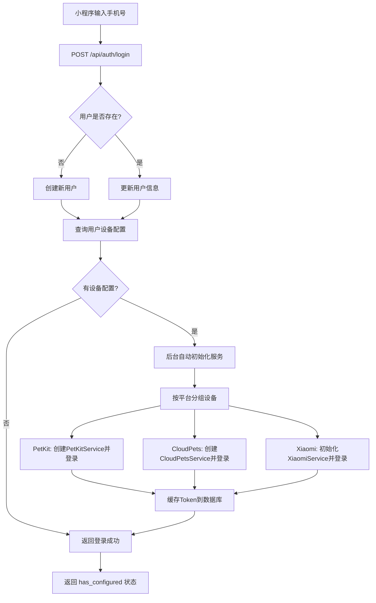
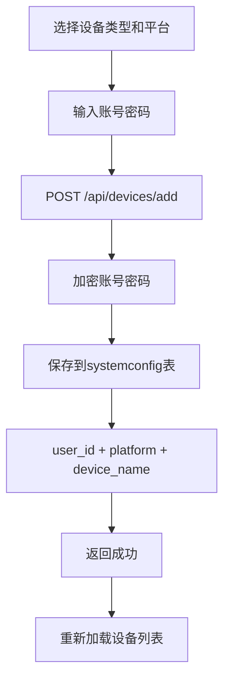
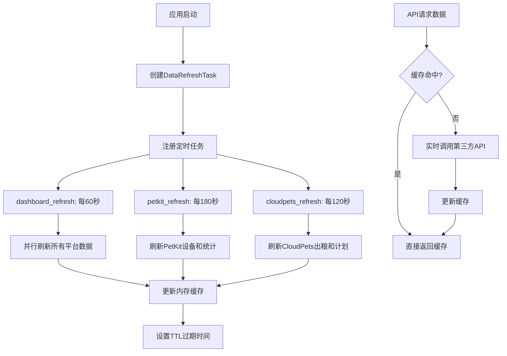
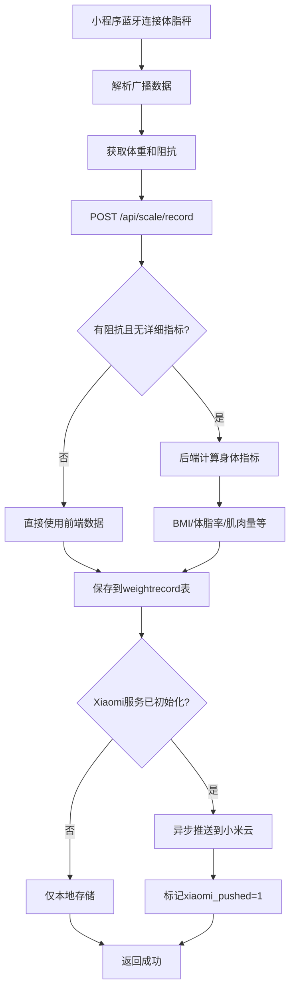

# AutoHome 智能家居控制中心 - 系统架构设计文档

## 1. 项目概述

### 1.1 项目简介
AutoHome 是一个轻量级的家庭智能设备聚合控制平台，通过统一的入口管理不同品牌的智能设备。支持 PetKit（小佩）智能猫厕所、CloudPets（云宠）智能喂食器以及小米体脂秤的集中管理和控制。

### 1.2 核心功能
- **智能猫厕所管理**：实时监控状态、远程控制清理/除臭、查看统计数据
- **智能喂食器管理**：定时喂食计划管理、手动投喂、出粮统计
- **健康监测**：蓝牙直连体脂秤、身体指标计算、数据同步到小米云
- **多用户支持**：手机号登录、设备独立配置、数据隔离
- **缓存优化**：内存缓存减少API调用、提升响应速度

### 1.3 技术栈概览
| 层级 | 技术选型 |
|------|---------|
| 后端框架 | Python 3.12 + FastAPI |
| 数据库 | MySQL 8.0+ (SQLModel ORM) |
| 前端 | 微信小程序原生开发 |
| 部署 | Vercel Serverless / 本地服务器 |
| 异步处理 | asyncio + aiohttp |
| 定时任务 | 自定义异步调度器 |

---

## 2. 系统架构设计

### 2.1 整体架构图

```
┌─────────────────────────────────────────────────────────────┐
│                     微信小程序客户端                          │
│  ┌──────────┐ ┌──────────┐ ┌──────────┐ ┌──────────────┐  │
│  │ 首页/登录 │ │ 猫厕所   │ │ 喂食器   │ │ 体脂秤       │  │
│  └──────────┘ └──────────┘ └──────────┘ └──────────────┘  │
└──────────────────────┬──────────────────────────────────────┘
                       │ HTTPS / HTTP
                       ▼
┌─────────────────────────────────────────────────────────────┐
│                    FastAPI 后端服务                           │
│  ┌──────────────────────────────────────────────────────┐  │
│  │                  API 路由层                            │  │
│  │  /api/auth/*  /api/petkit/*  /api/cloudpets/*        │  │
│  │  /api/xiaomi/*  /api/scale/*  /api/config/*          │  │
│  └──────────────────────────────────────────────────────┘  │
│  ┌──────────────────────────────────────────────────────┐  │
│  │              业务逻辑层 (Services)                     │  │
│  │  • PetKitService     • CloudPetsService              │  │
│  │  • XiaomiCloudService                                │  │
│  └──────────────────────────────────────────────────────┘  │
│  ┌──────────────────────────────────────────────────────┐  │
│  │              工具层 (Utils)                            │  │
│  │  • CacheManager      • ConfigEncryptor               │  │
│  │  • ConfigManager                                     │  │
│  └──────────────────────────────────────────────────────┘  │
│  ┌──────────────────────────────────────────────────────┐  │
│  │            定时任务调度器 (Scheduler)                  │  │
│  │  • 数据刷新任务    • 缓存更新                         │  │
│  └──────────────────────────────────────────────────────┘  │
└──────────────────────┬──────────────────────────────────────┘
                       │
         ┌─────────────┼─────────────┐
         ▼             ▼             ▼
   ┌──────────┐ ┌──────────┐ ┌──────────────┐
   │  MySQL   │ │ PetKit   │ │ CloudPets    │
   │  数据库  │ │ 云平台   │ │ 云平台       │
   └──────────┘ └──────────┘ └──────────────┘
         │
         ▼
   ┌──────────────┐
   │  小米云平台   │
   └──────────────┘
```

### 2.2 目录结构说明

```
auto-home/
├── backend/                    # 后端服务
│   ├── app/
│   │   ├── main.py            # FastAPI 应用入口、路由定义
│   │   ├── models/
│   │   │   ├── db.py          # 数据库引擎、会话管理
│   │   │   └── models.py      # SQLModel 数据模型
│   │   ├── services/
│   │   │   ├── petkit_service.py      # PetKit 设备服务
│   │   │   ├── cloudpets_service.py   # CloudPets 设备服务
│   │   │   └── xiaomi_service.py      # 小米云服务
│   │   ├── scheduler/
│   │   │   └── task_scheduler.py      # 异步定时任务调度器
│   │   └── utils/
│   │       ├── cache_manager.py       # 内存缓存管理器
│   │       ├── config_manager.py      # 配置管理工具
│   │       └── config_encryptor.py    # 配置加密工具
│   └── static/                # Web 控制台静态文件
├── miniprogram/               # 微信小程序
│   ├── pages/
│   │   ├── index/             # 首页/登录/设备管理
│   │   ├── feeder/            # 喂食器页面
│   │   ├── litterbox/         # 猫厕所页面
│   │   └── scale/             # 体脂秤页面
│   ├── utils/
│   │   ├── cloud_request.js   # 统一请求封装（支持云托管/本地）
│   │   └── ble_scale.js       # 蓝牙体脂秤数据解析
│   └── app.js                 # 小程序入口
├── database/
│   └── schema_mysql.sql       # MySQL 数据库建表脚本
└── vercel.json                # Vercel 部署配置
```

---

## 3. 数据库设计

### 3.1 ER 图

```
┌──────────────┐         ┌──────────────────┐
│    user      │1       *│  systemconfig    │
├──────────────┤─────────├──────────────────┤
│ id (PK)      │         │ id (PK)          │
│ phone_number │         │ user_id (FK)     │
│ nickname     │         │ key              │
│ gender       │         │ value            │
│ age          │         │ platform         │
│ height       │         │ device_name      │
│ created_at   │         │ is_encrypted     │
│ updated_at   │         │ updated_at       │
└──────────────┘         └──────────────────┘
       │1
       │
       │*
┌──────────────────┐
│  weightrecord    │
├──────────────────┤
│ id (PK)          │
│ user_id (FK)     │
│ weight           │
│ impedance        │
│ bmi              │
│ body_fat         │
│ muscle           │
│ water            │
│ visceral_fat     │
│ bone_mass        │
│ bmr              │
│ timestamp        │
│ xiaomi_pushed    │
│ xiaomi_push_time │
│ created_at       │
└──────────────────┘
```

### 3.2 表结构详解

#### 3.2.1 用户表 (user)
存储小程序用户基本信息，使用自增主键。

| 字段名 | 类型 | 说明 | 约束 |
|--------|------|------|------|
| id | INT | 用户ID | PRIMARY KEY, AUTO_INCREMENT |
| phone_number | VARCHAR(20) | 手机号（唯一标识） | UNIQUE, NOT NULL |
| nickname | VARCHAR(100) | 昵称 | - |
| gender | VARCHAR(10) | 性别：male/female | DEFAULT 'male' |
| age | INT | 年龄 | DEFAULT 25 |
| height | INT | 身高（cm） | DEFAULT 175 |
| created_at | TIMESTAMP | 创建时间 | DEFAULT CURRENT_TIMESTAMP |
| updated_at | TIMESTAMP | 更新时间 | ON UPDATE CURRENT_TIMESTAMP |

**索引**：
- `phone_number`：唯一索引，用于快速查找用户

#### 3.2.2 系统配置表 (systemconfig)
支持多用户多设备的配置存储，账号密码加密存储。

| 字段名 | 类型 | 说明 | 约束 |
|--------|------|------|------|
| id | INT | 配置ID | PRIMARY KEY, AUTO_INCREMENT |
| user_id | INT | 关联用户ID（0=全局配置） | FOREIGN KEY → user.id |
| key | VARCHAR(50) | 配置键（account/password等） | NOT NULL |
| value | TEXT | 配置值（加密或明文） | NOT NULL |
| platform | VARCHAR(50) | 平台：petkit/xiaomi/cloudpets | INDEX |
| device_name | VARCHAR(100) | 设备名称 | - |
| is_encrypted | TINYINT(1) | 是否加密：0=明文, 1=加密 | DEFAULT 0 |
| updated_at | BIGINT | 更新时间戳（毫秒） | NOT NULL |

**索引**：
- `idx_user_key`：(user_id, key) 联合索引
- `idx_platform`：platform 索引

**外键约束**：
- `fk_config_user`：user_id → user.id，级联删除

**典型配置示例**：
```sql
-- 全局配置
INSERT INTO systemconfig (user_id, `key`, value, is_encrypted, updated_at)
VALUES (0, 'app_version', '0.5.0', 0, UNIX_TIMESTAMP() * 1000);

-- 用户设备配置（加密）
INSERT INTO systemconfig (user_id, `key`, value, platform, device_name, is_encrypted, updated_at)
VALUES 
  (1, 'account', '加密后的账号', 'petkit', '小佩猫厕所', 1, ...),
  (1, 'password', '加密后的密码', 'petkit', '小佩猫厕所', 1, ...);
```

#### 3.2.3 体重记录表 (weightrecord)
存储体脂秤测量数据及身体指标。

| 字段名 | 类型 | 说明 | 约束 |
|--------|------|------|------|
| id | INT | 记录ID | PRIMARY KEY, AUTO_INCREMENT |
| user_id | INT | 关联用户ID | FOREIGN KEY → user.id |
| weight | DECIMAL(5,2) | 体重（kg） | NOT NULL |
| impedance | INT | 阻抗值 | - |
| bmi | DECIMAL(5,2) | BMI指数 | - |
| body_fat | DECIMAL(5,2) | 体脂率（%） | - |
| muscle | DECIMAL(5,2) | 肌肉量（kg） | - |
| water | DECIMAL(5,2) | 水分（%） | - |
| visceral_fat | DECIMAL(5,2) | 内脏脂肪等级 | - |
| bone_mass | DECIMAL(5,2) | 骨量（kg） | - |
| bmr | DECIMAL(8,2) | 基础代谢（kcal） | - |
| timestamp | BIGINT | 时间戳（毫秒） | NOT NULL, INDEX |
| xiaomi_pushed | TINYINT(1) | 是否已推送至小米 | DEFAULT 0 |
| xiaomi_push_time | TIMESTAMP | 小米推送时间 | - |
| created_at | TIMESTAMP | 创建时间 | DEFAULT CURRENT_TIMESTAMP |

**索引**：
- `idx_user_id`：user_id 索引
- `idx_timestamp`：timestamp 降序索引

**外键约束**：
- `fk_weight_user`：user_id → user.id，级联删除

---

## 4. 第三方接口与SDK集成

### 4.1 PetKit（小佩）云平台

#### 4.1.1 集成方式
- **SDK**：`pypetkitapi` (Python异步库)
- **认证方式**：用户名密码登录，获取 Session Token
- **Token有效期**：30分钟，自动续期

#### 4.1.2 核心API调用

**1. 初始化与登录**
```python
from pypetkitapi.client import PetKitClient

client = PetKitClient(
    username="86-手机号",
    password="密码",
    region="CN",
    timezone="Asia/Shanghai",
    session=aiohttp.ClientSession()
)
await client.get_devices_data()  # 登录并获取设备列表
```

**2. 获取设备列表**
```python
devices = client.petkit_entities  # Dict[device_id, DeviceEntity]
```

**3. 发送控制指令**
```python
from pypetkitapi.command import DeviceCommand, DeviceAction, LBCommand

# 清理猫砂盆
await client.send_api_request(
    device_id,
    DeviceCommand.CONTROL_DEVICE,
    {DeviceAction.START: LBCommand.CLEANING}
)

# 除臭
await client.send_api_request(
    device_id,
    LitterCommand.CONTROL_DEVICE,
    {DeviceAction.START: LBCommand.DESODORIZE}
)
```

**4. 获取统计数据**
```python
# 今日统计数据
device_stats = entity.device_stats
today_visits = device_stats.times  # 今日如厕次数
avg_duration = device_stats.avg_time  # 平均时长
last_pet_weight = device_stats.statistic_info[-1].pet_weight / 1000.0  # 最新体重(kg)
```

#### 4.1.3 设备类型识别
- **T3/T4/T5**：猫厕所型号
- 通过 `entity.device_nfo.device_type` 准确识别
- 过滤掉宠物档案等非设备实体（检查 `pet_id` 属性）

#### 4.1.4 会话管理策略
1. **首次登录**：保存会话信息到 `systemconfig` 表
2. **加载会话**：启动时从数据库读取，检查30分钟有效期
3. **自动续期**：检测到401错误时自动重新登录
4. **SSL处理**：支持禁用SSL验证（开发环境）

---

### 4.2 CloudPets（云宠）云平台

#### 4.2.1 集成方式
- **协议**：RESTful HTTP API
- **认证方式**：Bearer Token（Authorization Header）
- **Token有效期**：未明确，401时自动重登

#### 4.2.2 核心API端点

**1. 用户登录**
```
POST /app/terminal/user/login
Content-Type: application/x-www-form-urlencoded

参数：
- account: 手机号（去除86-前缀）
- pwd: 密码
- userType: 1

响应：
{
  "authorization": "Bearer token",
  ...
}
```

**2. 获取今日出粮份数**
```
POST /app/terminal/feeder/servingsToday
参数：deviceId=336704
```

**3. 手动喂食**
```
POST /app/terminal/feeder/manualFeed
参数：
- deviceId: 336704
- unit: 1（份数）
```

**4. 获取喂食计划列表**
```
GET /app/terminal/feeder/planList/{deviceId}
参数：
- deviceType: 66
- pageNum: 1
- pageSize: 1000

响应格式：
{
  "rows": [
    {
      "id": "计划ID",
      "hour": 8,
      "minute": 0,
      "serving": 1,
      "enable": true,
      "daysOfWeek": [1,2,3,4,5,6,7],
      "remark": ""
    }
  ]
}
```

**5. 新增喂食计划**
```
POST /app/terminal/feeder/feedPlan
参数：
- deviceId: 336704
- daysOfWeek: "1,2,3,4,5,6,7"
- enable: "true"/"false"
- hour: 8
- minute: 0
- serving: 1
- remark: ""
```

**6. 修改喂食计划**
```
PUT /app/terminal/feeder/feedPlan
参数同新增，额外包含 id 字段
```

**7. 删除喂食计划**
```
DELETE /app/terminal/feeder/plan/{planId}
```

**8. 获取设备状态**
```
POST /app/terminal/feeder/status
参数：deviceId=336704
```

#### 4.2.3 自动重试机制
```python
async def _request(self, method: str, url: str, **kwargs):
    resp = await self.client.request(method, url, **kwargs)
    
    # 检测401错误（HTTP状态码或业务码）
    should_retry = resp.status_code == 401
    if not should_retry and resp.status_code == 200:
        data = resp.json()
        if isinstance(data, dict) and str(data.get("code")) == "401":
            should_retry = True
    
    if should_retry:
        # 自动重新登录并重试
        if await self._login(self.account, self.password):
            resp = await self.client.request(method, url, **kwargs)
    
    return resp
```

---

### 4.3 小米云平台

#### 4.3.1 集成方式
- **协议**：加密HTTP API（RC4加密）
- **认证方式**：三步登录获取 serviceToken
- **Token有效期**：24小时

#### 4.3.2 登录流程（三步认证）

**Step 1: 获取 _sign**
```
GET https://account.xiaomi.com/pass/serviceLogin?sid=xiaomiio&_json=true
Cookie: userId=手机号

响应：
{
  "_sign": "签名值",
  ...
}
```

**Step 2: 认证获取 ssecurity**
```
POST https://account.xiaomi.com/pass/serviceLoginAuth2
参数：
- sid: xiaomiio
- hash: MD5(密码).toUpperCase()
- callback: https://sts.api.io.mi.com/sts
- qs: %3Fsid%3Dxiaomiio%26_json%3Dtrue
- user: 手机号（去除+86/86-前缀）
- _sign: Step1获取的签名
- _json: true

响应：
{
  "ssecurity": "安全密钥",
  "userId": "用户ID",
  "location": "重定向URL",
  "code": 0
}
```

**Step 3: 获取 serviceToken**
```
GET {location from Step2}

响应Cookies:
- serviceToken: 服务令牌
```

#### 4.3.3 推送体重数据

**API端点**
```
POST https://cn.api.io.mi.com/app/v2/device/ble_weight_upload
```

**加密参数生成**
```python
# 1. 生成 nonce
nonce = os.urandom(8) + (millis / 60000).to_bytes(4, 'big')
nonce_b64 = base64.b64encode(nonce).decode()

# 2. 生成 signed_nonce
hash_object = hashlib.sha256(
    base64.b64decode(ssecurity) + base64.b64decode(nonce_b64)
)
signed_nonce = base64.b64encode(hash_object.digest()).decode()

# 3. RC4加密数据
def encrypt_rc4(password: str, payload: str) -> str:
    r = ARC4.new(base64.b64decode(password))
    r.encrypt(bytes(1024))  # 跳过前1024字节
    return base64.b64encode(r.encrypt(payload.encode())).decode()

# 4. 生成签名
signature_params = ["POST", url_path, "data=加密值", signed_nonce]
signature = base64.b64encode(
    hashlib.sha1("&".join(signature_params).encode()).digest()
).decode()
```

**请求参数**
```python
headers = {
    "User-Agent": generated_agent,
    "x-xiaomi-protocal-flag-cli": "PROTOCAL-HTTP2",
    "MIOT-ENCRYPT-ALGORITHM": "ENCRYPT-RC4",
}

cookies = {
    "userId": user_id,
    "serviceToken": service_token,
}

params = {
    "data": encrypt_rc4(signed_nonce, json.dumps(weight_info)),
    "signature": signature,
    "ssecurity": ssecurity,
    "_nonce": nonce_b64,
}
```

**体重数据格式**
```json
{
  "weigh_scale": {
    "weight": 6500,          // 体重(g) = kg * 100
    "fat": 1850,             // 体脂率(%) * 100
    "bmi": 225,              // BMI * 10
    "muscle": 4500,          // 肌肉量(kg) * 100
    "water": 550,            // 水分(%) * 10
    "visceral_fat": 80,      // 内脏脂肪等级 * 10
    "bone_mass": 320,        // 骨量(kg) * 100
    "bmr": 1500,             // 基础代谢(kcal)
    "impedance": 550,        // 阻抗值
    "user_id": "12345",
    "measure_time": 1713792000
  }
}
```

#### 4.3.4 响应解密
```python
def decrypt_rc4(password: str, payload: str) -> str:
    r = ARC4.new(base64.b64decode(password))
    r.encrypt(bytes(1024))  # 跳过前1024字节
    return r.encrypt(base64.b64decode(payload))
```

---

## 5. 核心业务流程

### 5.1 用户登录与设备初始化流程



**关键代码位置**：`backend/app/main.py` 第646-783行

### 5.2 设备添加流程



**配置存储结构**：
```
systemconfig 表：
- user_id: 1
- key: "account"
- value: "加密后的账号"
- platform: "petkit"
- device_name: "小佩猫厕所"
- is_encrypted: 1

- user_id: 1
- key: "password"
- value: "加密后的密码"
- platform: "petkit"
- device_name: "小佩猫厕所"
- is_encrypted: 1
```

### 5.3 数据缓存与刷新机制



**缓存策略**：
| 缓存键 | TTL | 说明 |
|--------|-----|------|
| `petkit_devices` | 300s | PetKit设备列表 |
| `petkit_stats_{id}` | 180s | 单个设备统计 |
| `cloudpets_servings` | 120s | 今日出粮份数 |
| `cloudpets_plans` | 300s | 喂食计划列表 |
| `dashboard_combined_data` | 60s | 首页聚合数据 |

**关键代码位置**：
- 缓存管理器：`backend/app/utils/cache_manager.py`
- 定时任务：`backend/app/scheduler/task_scheduler.py`

### 5.4 体重数据同步流程



**身体指标计算算法**（简化版）：
```python
def calculate_body_metrics(weight, impedance, user):
    height_m = user.height / 100.0
    bmi = weight / (height_m ** 2)
    
    # 体脂率估算
    if user.gender == "male":
        body_fat = 0.8 * bmi + 0.1 * user.age - 5.4
    else:
        body_fat = 0.8 * bmi + 0.1 * user.age + 4.1
    
    # 阻抗修正
    if impedance > 0:
        impedance_factor = (impedance - 500) / 100.0
        body_fat += impedance_factor
    
    # 其他指标
    muscle = weight * (1 - body_fat / 100.0) * 0.75
    water = (100 - body_fat) * 0.7
    visceral_fat = max(1.0, min(bmi - 13.0, 20.0))
    bone_mass = weight * 0.04
    bmr = weight * (24.0 if user.gender == "male" else 22.0)
    
    return {...}
```

---

## 6. 安全设计

### 6.1 配置加密方案

**加密算法**：XOR + Base64
```python
class ConfigEncryptor:
    _key = os.getenv('CONFIG_ENCRYPTION_KEY', 'auto_home_secret_key_2024')
    
    @classmethod
    def encrypt(cls, plaintext: str) -> str:
        text_bytes = plaintext.encode('utf-8')
        encrypted_bytes = bytes([
            text_bytes[i] ^ cls._key[i % len(cls._key)]
            for i in range(len(text_bytes))
        ])
        return base64.b64encode(encrypted_bytes).decode('utf-8')
    
    @classmethod
    def decrypt(cls, ciphertext: str) -> str:
        encrypted_bytes = base64.b64decode(ciphertext.encode('utf-8'))
        decrypted_bytes = bytes([
            encrypted_bytes[i] ^ cls._key[i % len(cls._key)]
            for i in range(len(encrypted_bytes))
        ])
        return decrypted_bytes.decode('utf-8')
```

**加密字段**：
- `systemconfig.value`：当 `is_encrypted=1` 时
- 敏感配置键：`account`, `password`, `XIAOMI_ACCOUNT`, `XIAOMI_PASSWORD`

**安全性说明**：
- XOR加密适合防止明文存储，非高强度加密
- 建议生产环境使用环境变量 `CONFIG_ENCRYPTION_KEY` 设置强密钥
- 可升级为 AES-256 加密增强安全性

### 6.2 Token安全管理

**Token存储策略**：
1. **PetKit**：会话数据JSON序列化后存入 `systemconfig`
2. **CloudPets**：Bearer Token明文存储（依赖HTTPS传输安全）
3. **Xiaomi**：ssecurity、userId、serviceToken JSON序列化存储

**Token生命周期**：
- PetKit：30分钟，自动检测过期并重登
- CloudPets：未知，401时自动重登
- Xiaomi：24小时，超时后需重新登录

### 6.3 数据传输安全

- **HTTPS**：所有外部API调用强制HTTPS
- **SSL验证**：默认启用，开发环境可通过配置禁用
- **微信云托管**：生产环境使用微信提供的HTTPS通道

---

## 7. 性能优化设计

### 7.1 缓存策略

**三级缓存架构**：
1. **内存缓存**（CacheManager）：热点数据，TTL自动过期
2. **数据库缓存**：Token/会话持久化存储
3. **前端缓存**：小程序本地存储（userInfo等）

**缓存命中率优化**：
- 首页聚合数据：60秒TTL，减少并发请求
- 设备统计：180秒TTL，平衡实时性与性能
- 喂食计划：300秒TTL，低频变化数据

### 7.2 异步处理

**异步IO优势**：
- FastAPI原生支持async/await
- aiohttp并发请求第三方API
- 异步定时任务不阻塞主线程

**并行数据刷新**：
```python
async def refresh_combined_dashboard_data(self):
    tasks = []
    if self.petkit_service:
        tasks.append(self.refresh_petkit_data())
    if self.cloudpets_service:
        tasks.append(self.refresh_cloudpets_data())
    
    await asyncio.gather(*tasks, return_exceptions=True)
```

### 7.3 数据库优化

**索引设计**：
- `user.phone_number`：唯一索引，快速登录查询
- `systemconfig(user_id, key)`：联合索引，配置快速检索
- `weightrecord.timestamp DESC`：降序索引，历史记录快速排序

**连接池管理**：
- SQLModel自动管理连接池
- Session上下文管理器确保连接释放
- 避免长事务占用连接

---

## 8. 部署架构

### 8.1 Vercel Serverless 部署

**部署流程**：
```
GitHub Push → Vercel Auto Deploy → Serverless Function
                                      ↓
                              Cold Start (首次请求)
                                      ↓
                              初始化数据库连接
                              初始化第三方服务
                                      ↓
                              处理请求
```

**vercel.json 配置**：
```json
{
  "rewrites": [
    {
      "source": "/(.*)",
      "destination": "/api/index.py"
    }
  ]
}
```

**环境变量配置**：
```
MYSQL_ADDRESS=mysql.example.com:3306
MYSQL_USERNAME=auto_home_user
MYSQL_PASSWORD=secure_password
CONFIG_ENCRYPTION_KEY=your_strong_key_here
```

**冷启动优化**：
- 数据库连接复用
- Token从数据库加载避免重复登录
- 轻量级依赖（避免大型ML库）

### 8.2 本地开发部署

**启动命令**：
```bash
uv run uvicorn backend.app.main:app --reload --host 0.0.0.0 --port 8000
```

**开发环境配置**：
```ini
# .env 文件
MYSQL_ADDRESS=localhost:3306
MYSQL_USERNAME=root
MYSQL_PASSWORD=password
PETKIT_DISABLE_SSL_VERIFY=true  # 仅开发环境
```

### 8.3 微信小程序配置

**网络请求域名**：
- 开发环境：`http://localhost:8000`（需开启调试模式）
- 生产环境：Vercel分配的HTTPS域名

**请求模式切换**：
```javascript
// miniprogram/utils/cloud_request.js
const CONFIG = {
  mode: 'local',  // 'local' | 'cloud'
  localBaseUrl: 'http://localhost:8000',
  cloudEnv: 'prod-xxx',
  cloudService: 'home'
}
```

---

## 9. 错误处理与容错

### 9.1 第三方API失败处理

**PetKit服务降级**：
```python
try:
    devices = await service.get_devices()
except Exception as e:
    if "Session expired" in str(e) or "401" in str(e):
        await self._login()  # 自动重登
        devices = await service.get_devices()  # 重试
    else:
        raise HTTPException(status_code=500, detail=str(e))
```

**CloudPets自动重试**：
- 检测401错误（HTTP状态码或业务码）
- 自动调用 `_login()` 获取新Token
- 重试原请求

**Xiaomi服务可选性**：
- 未配置账号时不影响核心功能
- 体重推送失败仅记录日志，不阻断流程

### 9.2 缓存失效保护

**缓存穿透防护**：
```python
cached_data = await cache_manager.get('key')
if cached_data:
    return cached_data

# 缓存未命中，实时获取
data = await fetch_from_api()
await cache_manager.set('key', data, ttl=300)
return data
```

**缓存雪崩预防**：
- 不同数据设置不同TTL（60s/120s/180s/300s）
- 避免大量缓存同时过期

### 9.3 前端错误提示

**503服务未配置提示**：
```javascript
if (err.statusCode === 503) {
  wx.showModal({
    title: '服务未配置',
    content: '该功能需要配置账号密码\n请在首页完成初始配置',
    confirmText: '去配置',
    success: (res) => {
      if (res.confirm) {
        wx.switchTab({ url: '/pages/index/index' })
      }
    }
  })
}
```

---

## 10. 扩展性设计

### 10.1 多用户多设备支持

**当前实现**：
- `systemconfig.user_id` 区分用户配置
- `platform` 和 `device_name` 区分同一用户的多个设备
- 登录时自动初始化该用户的所有设备服务

**扩展方向**：
- 支持一个用户添加多个同平台设备（如2个PetKit猫厕所）
- 设备共享功能（多个用户控制同一设备）

### 10.2 新设备平台接入

**接入步骤**：
1. 在 `backend/app/services/` 创建新的服务类（如 `newbrand_service.py`）
2. 实现 `initialize()`、`get_devices()`、控制方法
3. 在 `main.py` 中添加路由
4. 在小程序添加对应页面
5. 在 `systemconfig.platform` 枚举中新增平台标识

**示例伪代码**：
```python
class NewBrandService:
    async def initialize(self, user_id: int) -> bool:
        # 从数据库加载配置
        account = get_config_from_db("account", user_id, "newbrand")
        password = get_config_from_db("password", user_id, "newbrand")
        # 登录逻辑
        ...
    
    async def get_devices(self):
        # 获取设备列表
        ...
    
    async def control_device(self, device_id, action):
        # 控制设备
        ...
```

### 10.3 消息推送扩展

**当前实现**：
- 定时轮询（60s/120s/180s）

**可扩展方案**：
- WebSocket实时推送（需改造为长连接架构）
- 微信订阅消息（猫砂盆满、喂食完成等事件）
- MQTT协议接入（适用于支持MQTT的设备）

---

## 11. 监控与日志

### 11.1 日志记录

**日志级别**：
- `INFO`：正常业务流程（登录成功、数据刷新）
- `WARNING`：非致命问题（SSL禁用、Token过期）
- `ERROR`：严重错误（API调用失败、数据库异常）

**关键日志点**：
```python
logger.info(f"✓ PetKit 自动登录成功，发现 {len(devices)} 个设备")
logger.warning(f"⚠ PetKit 自动登录失败")
logger.error(f"Failed to refresh PetKit data: {e}")
```

### 11.2 性能监控

**启动耗时统计**：
```python
start_time = time.time()
init_db()
logger.info(f"✓ 数据库初始化完成，耗时：{time.time() - start_time:.2f}秒")
```

**缓存命中率监控**：
```python
@app.get("/api/cache/status")
async def cache_status():
    return {
        "size": await cache_manager.size(),
        "last_refresh": await cache_manager.get('dashboard_last_refresh')
    }
```

---

## 12. 关键技术决策说明

### 12.1 为什么选择内存缓存而非Redis？

**决策原因**：
1. **Serverless环境限制**：Vercel不支持持久化连接
2. **轻量级需求**：单实例场景下内存缓存足够
3. **简化运维**：无需额外部署Redis服务
4. **成本考量**：免费套餐无法运行Redis

**适用场景**：
- 单实例部署
- 数据一致性要求不高（允许短暂不一致）
- 缓存数据可从第三方API重建

**不适用场景**：
- 多实例负载均衡（需共享缓存）
- 高并发大规模部署

### 12.2 为什么使用XOR加密而非AES？

**决策原因**：
1. **性能优先**：XOR运算极快，无额外依赖
2. **简单可靠**：代码量少，易于维护
3. **防君子不防小人**：主要防止明文泄露，非对抗高级攻击
4. **可升级**：预留了切换到AES的接口

**安全建议**：
- 生产环境务必设置强密钥（环境变量）
- 如需更高安全性，替换为 `cryptography` 库的AES实现

### 12.3 为什么采用轮询而非WebSocket？

**决策原因**：
1. **第三方API限制**：PetKit/CloudPets不提供实时推送
2. **Serverless兼容性**：WebSocket在Vercel上实现复杂
3. **功耗考虑**：小程序频繁心跳增加耗电
4. **够用原则**：60秒延迟对智能家居可接受

**改进方向**：
- 如需更低延迟，可改为前端主动触发刷新
- 或迁移到支持WebSocket的云服务器（如腾讯云CVM）

---

## 13. 待优化项与技术债务

### 13.1 已知问题

1. **CloudPets设备ID硬编码**
   - 位置：`cloudpets_service.py` 第17行
   - 影响：只能控制单一设备
   - 改进：从数据库动态读取设备ID

2. **Xiaomi服务单例限制**
   - 位置：`xiaomi_service.py` 第460行
   - 影响：多用户共用同一账号
   - 改进：支持每个用户独立的小米账号

3. **缺少设备删除功能**
   - 现状：只能添加设备，无法删除
   - 改进：添加 `/api/devices/delete` 接口

### 13.2 性能瓶颈

1. **冷启动时间长**
   - 原因：首次请求需初始化所有服务
   - 优化：预热机制或保持函数活跃

2. **数据库查询未分页**
   - 位置：体重历史记录查询
   - 优化：添加游标分页

### 13.3 安全加固

1. **速率限制缺失**
   - 风险：API可能被滥用
   - 改进：添加 `slowapi` 限流中间件

2. **输入验证不足**
   - 风险：SQL注入/XSS（虽然ORM已防护）
   - 改进：添加Pydantic严格验证

---

## 14. 附录

### 14.1 环境变量清单

| 变量名 | 必填 | 说明 | 示例 |
|--------|------|------|------|
| MYSQL_ADDRESS | 是 | MySQL地址 | `mysql.example.com:3306` |
| MYSQL_USERNAME | 是 | 数据库用户名 | `auto_home_user` |
| MYSQL_PASSWORD | 是 | 数据库密码 | `secure_pass` |
| CONFIG_ENCRYPTION_KEY | 否 | 配置加密密钥 | `strong_random_key` |
| PETKIT_DISABLE_SSL_VERIFY | 否 | 禁用SSL验证（仅开发） | `true/false` |

### 14.2 API接口清单

#### 认证相关
- `POST /api/auth/login` - 用户登录/注册
- `GET /api/auth/check-config` - 检查用户配置状态
- `POST /api/auth/reinit-services` - 重新初始化服务

#### PetKit相关
- `GET /api/petkit/devices` - 获取设备列表
- `POST /api/petkit/clean` - 清理猫砂盆
- `POST /api/petkit/deodorize` - 除臭
- `GET /api/petkit/stats` - 获取统计数据
- `GET /api/petkit/devices-stats` - 设备列表+统计

#### CloudPets相关
- `GET /api/cloudpets/servings_today` - 今日出粮份数
- `POST /api/cloudpets/feed` - 手动喂食
- `GET /api/cloudpets/plans` - 获取喂食计划
- `POST /api/cloudpets/plans` - 新增计划
- `PUT /api/cloudpets/plans/{id}` - 修改计划
- `DELETE /api/cloudpets/plans/{id}` - 删除计划

#### 小米云相关
- `GET /api/xiaomi/status` - 服务状态
- `POST /api/xiaomi/login` - 手动登录
- `POST /api/xiaomi/push-weight` - 推送体重数据

#### 体脂秤相关
- `GET /api/scale/history/{user_id}` - 历史记录
- `POST /api/scale/record` - 保存记录

#### 配置相关
- `GET /api/config/list` - 配置列表
- `GET /api/config/{key}` - 获取配置
- `POST /api/config` - 保存配置
- `DELETE /api/config/{key}` - 删除配置

#### 缓存相关
- `GET /api/cache/status` - 缓存状态
- `POST /api/cache/refresh` - 强制刷新

#### 聚合数据
- `GET /api/dashboard/data` - 首页聚合数据

### 14.3 依赖包清单

**后端依赖**：
```txt
fastapi==0.109.0
uvicorn==0.27.0
sqlmodel==0.0.14
pymysql==1.1.0
aiohttp==3.9.1
pypetkitapi==0.2.5
httpx==0.26.0
pycryptodome==3.20.0
python-dotenv==1.0.0
requests==2.31.0
```

**小程序基础库**：
- 最低版本：2.2.3（支持云开发）
- 推荐版本：2.30.0+

### 14.4 参考资源

- **pypetkitapi文档**：https://github.com/yourusername/pypetkitapi
- **小米IoT协议分析**：https://github.com/OpenMiHome/mihome-binary-protocol
- **FastAPI官方文档**：https://fastapi.tiangolo.com/
- **微信小程序开发文档**：https://developers.weixin.qq.com/miniprogram/dev/framework/

---

## 15. 总结

AutoHome 项目通过合理的技术选型和架构设计，实现了多品牌智能设备的统一管理。核心优势包括：

✅ **轻量高效**：FastAPI + 内存缓存，响应迅速  
✅ **安全可靠**：配置加密、Token自动管理、HTTPS传输  
✅ **易于扩展**：模块化设计，新设备平台接入简单  
✅ **用户体验**：自动初始化、缓存优化、友好错误提示  

未来可通过引入WebSocket、消息队列、更强大的加密方案进一步提升系统性能和安全性。

---

**文档版本**：v1.0  
**最后更新**：2026-04-22  
**维护者**：AutoHome 开发团队
